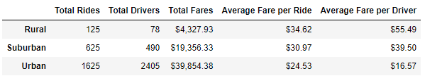

# PyBer Ride-Share Analysis

## Overview of the PyBer Ride-Share Analysis
V. Isualize has requested the creation of a summary DataFrame of the ride-sharing data by city type. Then, the creation of a multiple-line graph that shows the total weekly fares for each city type.

## Resources
- Data Source: city_data.csv, ride_data.csv
- Software: Python 3.9.6, Conda 4.10.3

## Analysis Results
As shown in the summary DataFrame below, we can make the following observations:

- Urban areas have the most drivers, followed by Suburan areas, and Rural areas have the least number of drivers.
- Urban areas deliver the most rides, followed by Suburan areas, and Rural areas deliver the least number of rides.
- Urban areas generate the most fares, followed by Suburan areas, and Rural areas generate the least fares.
- Urban areas have the lowest fare per ride, followed by Suburan areas, and Rural areas have the most expensive fare per ride.
- Urban areas have the lowest fare per driver, followed by Suburan areas, and Rural areas have the highest fare per driver.

As shown in the line chart below, we can make the following observations:

- Over any month in this dataset; Urban areas generate the most fares, followed by Suburan areas, and Rural areas generate the least fares.
- There does not seem to be any month where fares deviate too far from the average in any city type.

## Summary
Based on the results, I would recommend the following strategies:
1. The highest fares are generated from urban cities, and they should be the first choice when looking to expand PyBer into more cities.
2. The urban markets seem to be saturated with drivers, and rural markets seem to be lacking in drivers. It may be valuable to do some research to discover how much driver time is spent idling. With some more research into the driver's time spent idle, in each city type, there could be a way to increase fares by shifting more drivers into rural and suburban areas.
3. Increasing the length of time analyzed in the chart beyond 4 months to discover potential trends for each city type based on the time of year. This way drivers can be shifted between city types at different points of the year to maximize efficiency.
4. Further analysis into individual cities within each city type. There may be large differences in the data between individual cities that fit into the same city type. Further analysis here can help determine more specific locations ideal for expansion, as well as potential opportunities to maximize efficiency for individual cities.
